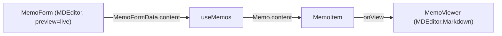

# 마크다운 뷰어 및 편집 기능 추가

## 개요
`@uiw/react-md-editor`(v4.1.1, React 19 호환)를 사용해 메모 본문을 마크다운으로 작성/편집하고, 상세 보기에서 렌더링한다. Next.js App Router 환경이므로 `next/dynamic` + `ssr: false`로 클라이언트 전용 로드한다.

## 1. 패키지 설치
- `npm install @uiw/react-md-editor`
- React 19와 호환되나 peer dependency 경고 발생 시 `--legacy-peer-deps` 사용.

## 2. CSS 로드 — [src/app/layout.tsx](src/app/layout.tsx)
- 에디터 스타일을 위해 최상단에 CSS import 추가:

```tsx
import '@uiw/react-md-editor/markdown-editor.css'
```

## 3. 작성/편집 폼에 에디터 적용 — [src/components/MemoForm.tsx](src/components/MemoForm.tsx)
- 기존 본문 `<textarea>` (179~192행)를 `MDEditor`로 교체.
- SSR 회피를 위해 동적 import:

```tsx
const MDEditor = dynamic(() => import('@uiw/react-md-editor'), { ssr: false })
```

- 기본 모드 `preview="live"`로 실시간 프리뷰 제공. 컨테이너에 `data-color-mode="light"` 래퍼 추가(프로젝트는 라이트 테마).
- `onChange`가 `string | undefined`를 반환하므로 `value ?? ''`로 처리.
- 본문 필수 검증(`handleSubmit`의 `formData.content.trim()`) 로직은 그대로 유지.
- `height`는 prop(숫자)으로 지정(인라인 스타일 아님).

## 4. 상세 보기 뷰어에 렌더링 — [src/components/MemoViewer.tsx](src/components/MemoViewer.tsx)
- 본문 출력부(현재 `whitespace-pre-wrap` `<p>`, `data-testid="memo-viewer-content"`)를 마크다운 렌더러로 교체:

```tsx
const MDPreview = dynamic(
  () => import('@uiw/react-md-editor').then(m => m.default.Markdown),
  { ssr: false },
)
```

- `<MDPreview source={memo.content} />`를 `data-color-mode="light"` 래퍼로 감싸 렌더링.

## 5. 카드 목록 본문 미리보기 — [src/components/MemoItem.tsx](src/components/MemoItem.tsx)
- 카드의 본문 미리보기(`line-clamp-3`)는 마크다운 원문 텍스트를 그대로 표시(현행 유지). 작은 카드에 마크다운 렌더링 시 레이아웃이 복잡해지므로 미리보기는 플레인 텍스트 유지.

## 검증
- `npm run build`로 타입/빌드 통과 확인.
- `npm run dev` 후: 새 메모 작성 시 에디터 우측에 실시간 프리뷰 표시, 저장 후 카드 클릭 → 뷰어에서 마크다운(제목/목록/굵게 등) 렌더링 확인.

## 참고: 데이터 흐름

